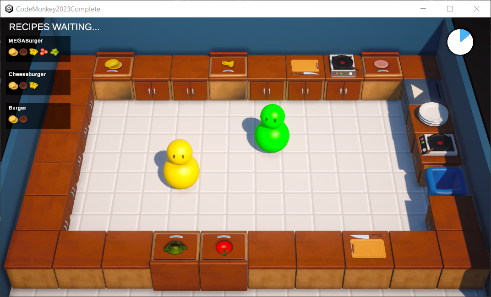

# Kitchen Chaos Online with netcode for gameObjects, Lobby & relay


**ABOUT THE PROJECT:** This project is based on Code Monkey's step-by-step tutorial on how to use Unity's netcode for game objects, lobby, and relay packages. You can find it [here.](https://www.youtube.com/watch?v=7glCsF9fv3s) This game project started as a single-player-only game; later on, netcode support was added. I've also uploaded the complete single-player repository on GitHub, [here.](https://github.com/OzgenKoklu/KitchenChaosSingleplayer) In this readme, I only mention the Netcode/Lobby/Relay-related features and coding. The repository for the single-player project includes details on the main game mechanics.

**Disclaimer:** All assets were borrowed from Code Monkey and are not intended for commercial use. This is a learning project, and I've built it independently under instructions from Code Monkey. 
This build won't run on your computer as is unless linked to Unity Services. To link, go to Edit > Project Settings > Services and connect to a project where Lobby and Relay services are enabled.

**ABOUT THE GAME:** This is a small-scale casual game highly inspired by OverCooked, where you must deliver specific orders within a time limit. 
It is a complete package with scene cycles, sound and animation, an options menu, savable settings, and key bindings, with added multiplayer!"

---
**TLDR:**  In Short, what I've learned from this project:

**1.** Implementing Netcode for GameObject, Lobby & Relay by Unity into an already existing single-player game.

**2.** Gaining a basic understanding of multiplayer game logic, including server/client authoritative design, RPCs, and basic solutions for poor connections.

**3.** Creating a fully functional game scene flow using Netcode for GameObjects, and subsequently utilizing lobby and relay services to enable online connectivity.

---
# Images

Main Menu

 

Lobby List UI

 

Character Select Scene

 

Settings UI

 


# GIFs

Gameplay 

 \

Character Select Screen 

 

# Youtube Video

Entire game loop can be viewed in this youtube video:

[](https://youtu.be/lrHCDELBiAE)

---

**On my decision to separate the project into two repositories:**

**Short answer:** *The source code changed too much.* 

Since I'm relatively new to multiplayer development, I'm not familiar with the structures and design choices implemented in its current state. Before this project, I hadn't worked on any multiplayer game projects. I had heard of Photon Network, which I believe is still a popular option for creating multiplayer games. The architectural requirements for a multiplayer game are entirely different, and the programmer must decide whether the game will be server authoritative or client authoritative, a decision that significantly impacts the project's structure. In single-player games, especially when you are at the very beginning of your developer journey, you mainly deal with what's on the screen, adjusting behaviors to make the gameplay. However, for multiplayer development, the entire communication process must be carefully thought out. There's an essence of backend development in this sense, where requests should be handled in particular ways. This project helped me further understand C# and OOP concepts. I grasped them while building it, but I still feel somewhat unfamiliar.

---
# More about what's covered in this project for those with more time:

The project is a course project by Code Monkey, and its curriculum can be found [here.](https://unitycodemonkey.com/kitchenchaosmultiplayercourse.php) However, I want to revisit my own commits and create my own list of what I've learned:

# **What I've learned:** 

# UNITY NETCODE FOR GAMEOBJECTS PACKAGE

**1.** ServerRPC/ClientRPC's, and how to set up a basic multiplayer architecture. 

**2.** Server Authoritative/Client Authoritative meaning and usage.

**Note:** The biggest difference between multiplayer and single-player is that we need to consider that the code running on the client and server devices should be different. This comes with challenges that require us to rethink from the beginning to both validate certain aspects and ensure the synchronous operation of certain elements. For example, the requirement for the DeliveryManager to only operate on the server and relay result reports to clients, with clients displaying things on the screen based on these results, necessitates more layered systems.

Fundamentally, every validation that affects gameplay should go through the server. Scripts like ClientNetworkTransform or OwnerNetworkAnimator, which essentially allow the setting of animations and transforms on the client side, should be controlled by the server if you want to make games that are more resistant to hacking and choose a "Server Authoritative" design.

**3.** NetworkBehaviour class and some of its functions. (OnNetworkSpawned(), isServer isOwner bool etc)

**4.** NetworkObject, NetworkManager's functions: StartHost(), StartClient()

**5.** Spawning Network Objects. 

**6.** Network Friendly data sharing: NetworkObjectReference, basic value types, local functions that aid this process. (index > scriptableObject, scriptableObject > index etc)


**Note:** Operations on objects with NetworkBehavior, such as destruction, instantiation, parent assignment, and changes in hierarchy, need to be communicated to other clients by the server. Therefore, a design has been implemented to gradually shift all logics involving these operations towards validation and/or notification through ServerRPCs.\

There are some limitations to sending arguments to ServerRPC; it's not as straightforward as accessing any data type and any script. Hence, it should work with simple data types like int and float, and access other classes through NetworkObjectReference.\

This, however, results in solving problems that could be handled with concise code into longer lines and passing through 2-3 different methods (like shown in Code Snippet 1), even though they are seemingly simple issues. While it may be straightforward, keeping the necessary data locally in a list and accessing it through an index can be a reasonable solution.\

Another example is, when kitchenObject sets its parent, it selected its transform directly, for online the reason FollowTransform.cs is necessary is that even if we have access to the class of the Parent Object passed through ServerRPC as a reference, 
the Transform information is incomplete. Therefore, rethinking such logics may be necessary from the beginning.

**Code Snippet 1:** From Assets/Scripts/KitchenGameMultiplayer.cs, SpawnKitchenObjectServerRpc() 

```csharp
   [ServerRpc(RequireOwnership = false)]
    private void SpawnKitchenObjectServerRpc(int kitchenObjectSOIndex, NetworkObjectReference kitchenObjectParentNetworkObjectReference)
    {
        KitchenObjectSO kitchenObjectSO = GetKitchenObjectSOFromIndex(kitchenObjectSOIndex);
        Transform kitchenObjectTransform = Instantiate(kitchenObjectSO.prefab);

        NetworkObject kitchenObjectNetworkObject = kitchenObjectTransform.GetComponent<NetworkObject>();
        kitchenObjectNetworkObject.Spawn(true);

        KitchenObject kitchenObject = kitchenObjectTransform.GetComponent<KitchenObject>();

        kitchenObjectParentNetworkObjectReference.TryGet(out NetworkObject kitchenObjectParentNetworkObject);
        IKitchenObjectParent kitchenObjectParent = kitchenObjectParentNetworkObject.GetComponent<IKitchenObjectParent>();
        kitchenObject.SetKitchenObjectParent(kitchenObjectParent);
    }
```

**7.** Multiplayer Game Logic flow, How to use timers in online and when to trigger serverRPC/ClientRPC.\

**Note:** In essence, the organization of events triggered by the client that we want other players to see, and the code structure of these events:

**Step 1)** The local player/client/server triggers a logic and directs it to ServerRPC.\
**Step 2)** ServerRPC validates and/or intervenes in a situation related to NetworkObject behaviors, and/or directs it to clientRPC.\
**Step 3)** ClientRPC provides a visual response, such as triggering an event in local code and/or playing an animation, opening UI.

In addition to the execution order in MonoBehaviour, special Netcode-specific execution functions such as OnNetworkSpawned should also be taken into account. Attention should be paid to where tasks such as event tracking should be performed.

**8.** NetworkVariable<T> for value types, including enums. Great for state machine design pattern and holding float timers. Comes with its own event .OnValueChanged 

**9.** Usage of Dictionary<TKey, TValue>, for player status registiration.

**10.** Logic that includes clientID's: serverRPCparams, NetworkManager.ClientIDs.

**Code Snippet 2:** Usage of dictionaries and ClientIds from Assets/Scripts/KitchenGameManager.cs\
```csharp
 private Dictionary<ulong, bool> playerPausedDictionary;

 private void TestGamePausedState()
    {
        foreach(ulong clientId in NetworkManager.Singleton.ConnectedClientsIds)
        {
            if(playerPausedDictionary.ContainsKey(clientId) && playerPausedDictionary[clientId])
            {
                //this player is paused
                isGamePaused.Value = true;
                return;
            }
        }
        //all players are unpaused 
        isGamePaused.Value = false;
    }
}
```
**11.** Handling Disconnects via NetworkManager's "OnClientDisconnectCallback" and connections via NetworkManager's "OnClientConnectedCallback":

**Note:** To prevent the game from crashing or becoming unresponsive during connection disruptions and when the connection is established, we subscribe to these callbacks and write some logics that will be triggered in case of disconnection or connection status. 

These logics may include functional aspects (such as pause/unpause/return to the main menu feature), visual-dimensional aspects (destroying game objects), and UI-related measures (displaying a disconnection alert).

**12.** Connection Approval, getting more function out of the Network Manager: 

**Note:** We are delving deeper into the features of the Network Manager. The requirement for ConnectionApproval provides an option to filter clients attempting to connect.

The ConnectionApprovalCallback sends a request and response struct when a client attempts to connect. With local logics, such as scene selection and the number of connected client IDs, we can assign the value 'Approved' to the Response.

Although not implemented for this game, a possible use case could involve checking the networkID from the ConnectionApprovalRequest struct against a list of banned players. If the player is in the list, we may choose not to allow the connection. This is one potential application that comes to mind.

**Code Snippet 3:** From Assets/Scripts/KitchenGameMultiplayer.cs, usage of connection approval

```csharp
	public void StartHost()
		{
			NetworkManager.Singleton.OnClientDisconnectCallback += NetworkManager_Server_OnClientDisconnectCallback;
			NetworkManager.Singleton.StartHost();
		}
	//...	
  private void NetworkManager_ConnectionApprovalCallback(NetworkManager.ConnectionApprovalRequest connectionApprovalRequest, NetworkManager.ConnectionApprovalResponse connectionApprovalResponse)
    {
        if (SceneManager.GetActiveScene().name != Loader.Scene.CharacterSelectScene.ToString())
        {
            connectionApprovalResponse.Approved = false;
            connectionApprovalResponse.Reason = "Game has already started";
            return;
        }

        if (NetworkManager.Singleton.ConnectedClientsIds.Count >= MAX_PLAYER_AMOUNT)
        {
            connectionApprovalResponse.Approved = false;
            connectionApprovalResponse.Reason = "Game is full";
            return;
        }
        connectionApprovalResponse.Approved = true;
    }
```
**13.** Scene flow handling in multiplayer projects: NetworkManager.SceneManager.LoadScene(), SceneManager.OnLoadEventCompleted, NetworkObject.SpawnPlayerObject()

When adding scene flow, lifetimes should be taken into account. For necessary elements, 'DontDestroyOnLoad' may be used, or for things that follow events but remain in a single scene, unsubscribing from events should be done in OnDestroy (to prevent unexpected behaviors and avoid memory leaks).

For similar reasons, when transitioning from the game to the main menu, instances and singletons should be cleared, static events reset, and the NetworkManager should be shut down. Additionally, since the connection can take a few seconds, it's important to display UI elements that alert the user when pressing the join button and provide notifications for connection errors. Therefore, UI indicators should be implemented using event systems.

**14.** Using Struct's to share data in multiplayer game logic. 

**Code Snippet 4:** Usage of struct for storing player data from Assets/Scripts/PlayerData.cs

```csharp
public struct PlayerData : INetworkSerializable, IEquatable<PlayerData> 
{

    public ulong clientId;
    public int colorId;
    public FixedString128Bytes playerName;
    public FixedString128Bytes playerId;
    public void NetworkSerialize<T>(BufferSerializer<T> serializer) where T : IReaderWriter
    {
        serializer.SerializeValue(ref clientId);
        serializer.SerializeValue(ref colorId);
        serializer.SerializeValue(ref playerName);
        serializer.SerializeValue(ref playerId);
    }

    bool IEquatable<PlayerData>.Equals(PlayerData other)
    {
        return 
            clientId == other.clientId &&
            colorId == other.colorId && 
            playerName == other.playerName && 
            playerId == other.playerId;
    }
}
```

Unlike in singleplayer where sharing between players is not straightforward, storing and including data in Structs and Network Lists provide great convenience. Structs can only hold value types, you need auxiliary functions to help them reach their full potential.

For instance, since it cannot directly store flat color data, we maintain colors in a list and access them through the indices referenced in this list. A significant portion of the codebase is dedicated to functions that return another data type to address these access issues in order to overcome serialization limitations.

Additionally, the NetworkList<T>.OnListChanged event makes it easy to track changes in this list. All elements subscribing to list changes are instantly notified of any data modifications.

This simplifies the implementation of various features such as displaying dummies on the screen, real-time printing of their names, and future updates like color changes. It greatly facilitates the dynamic management of elements on the screen.

**Code Snippet 5:** Sturct data rewriting procedure to trigger onListChanged event, From Assets/Scripts/KitchenGameMultiplayer.cs

```csharp
public event EventHandler OnPlayerDataNetworkListChanged;
//...
 private NetworkList<PlayerData> playerDataNetworkList;
//...Changing colorId of the struct with the help of some local auxiliary functions
 [ServerRpc(RequireOwnership = false)]
    private void ChangePlayerColorServerRpc(int colorId, ServerRpcParams serverRpcParams = default)
    {
        if (!IsColorAvailable(colorId))
        {
            //color not available
            return;
        }
        int playerDataIndex = GetPlayerDataIndexFromClientId(serverRpcParams.Receive.SenderClientId);

        PlayerData playerData = playerDataNetworkList[playerDataIndex];

        playerData.colorId = colorId;

        playerDataNetworkList[playerDataIndex] = playerData;
    }
//...Various auxiliary functions
 private bool IsColorAvailable(int colorId)
    {
        foreach (PlayerData playerData in playerDataNetworkList)
        {
            if (playerData.colorId == colorId)
            {
                //color already in use
                return false;

            }
        }
        return true;
    }	
public int GetPlayerDataIndexFromClientId(ulong clientId)
    {
        for(int i=0; i<playerDataNetworkList.Count; i++)
        { if (playerDataNetworkList[i].clientId == clientId)
            {
                return i;
            }
        }
        return -1;
    }

```
**15.** Can custumize StartHost() and StartClient() so that host and client can respond differently to a callback or event. 

In adition, the idea of introducing a 'kickPlayer' feature in the 'IsServer' state, where custom UI boxes can be displayed for both hosts and clients, has the potential to enrich the game. Having the same event yield different results on the server and client sides is also a promising use case. 

**16.** Extra validations, null checks or double checks needed to prevent bugs in multiplayer where connection isn't always perfect.


# UNITY LOBBY PACKAGE

**1.** Using Unity's official Lobby package, understanding basic concepts about lobby

**2.** LobbyService class methods and properties: SendHeartbeatPingAsync(), CreateLobbyAsync(), UpdateLobbyAsync(lobby.id, updateLobbyOptions), QuickJoinLobbyAsync(), DeleteLobbyAsync() etc.  

**3.** Lobby class and its properties: .HostId, .Id, .Data[TKey].Value, 

**4.** AuthenticationService class methods and properties: SignInAnonymouslyAsync(), IsSignedIn, PlayerId 

**5.** Searching Lobbies: LobbyService.QueryLobbiesAsync(), QueryFilter class, queryResponse class

**6.** Async methods with await


**Note:** Implementation of procedures for lobby usage that serves as a clear example. It provides a superficial application of what lobbies are responsible for, what features they have, and what factors can affect them.

Initially, it seemed complex and intricate. However, going through the code step by step, I realized that there is no obscure part that cannot be understood, but rather, the necessity of procedures and the use of numerous functions directly from the Lobby library indicated that I had not gained mastery over them.

In my opinion, it is remarkably easy to use. For now, there is no need to memorize or delve into more complex use cases. Unlike what is encountered in normal game coding, the presence of many abstracted functions may not be intuitive for a game developer, but as a programmer, it contributes to a better understanding of OOP.

# UNITY RELAY PACKAGE

**1.** Using Unity's official Relay package, understanding basic concepts about relay

**2.** RelayService class methods and properties: CreateAllocationAsync(), GetJoinCodeAsync(), JoinAllocationAsync()

**3.** Using Allocation for setting server data of the UnityTransport.

**4.** Task<T> return type for async funcions.

Example code that uses lobby and relay services together.

**Code Snippet 6:** Example code that uses lobby and relay services together from Assets/Scripts/KitchenGameLobby.cs

```csharp
     public async void CreateLobby(string lobbyName, bool isPrivate)
    {
        OnCreateLobbyStarted?.Invoke(this, EventArgs.Empty);
        try {
            joinedLobby = await LobbyService.Instance.CreateLobbyAsync(lobbyName, KitchenGameMultiplayer.MAX_PLAYER_AMOUNT, new CreateLobbyOptions {
                IsPrivate = isPrivate,
            });

            Allocation allocation = await AllocateRelay();
            
            string relayJoinCode = await GetRelayJoinCode(allocation);

            await LobbyService.Instance.UpdateLobbyAsync(joinedLobby.Id, new UpdateLobbyOptions
            {
                Data = new Dictionary<string, DataObject> {
                    {KEY_RELAY_JOIN_CODE, new DataObject(DataObject.VisibilityOptions.Member, relayJoinCode) }
                }
            }) ; 

            NetworkManager.Singleton.GetComponent<UnityTransport>().SetRelayServerData(new RelayServerData(allocation, "dtls"));

            KitchenGameMultiplayer.Instance.StartHost();
            Loader.LoadNetwork(Loader.Scene.CharacterSelectScene);
        } catch (LobbyServiceException e)
        {
            Debug.Log(e);
            OnCreateLobbyFailed?.Invoke(this, EventArgs.Empty);
        }
    }
```
